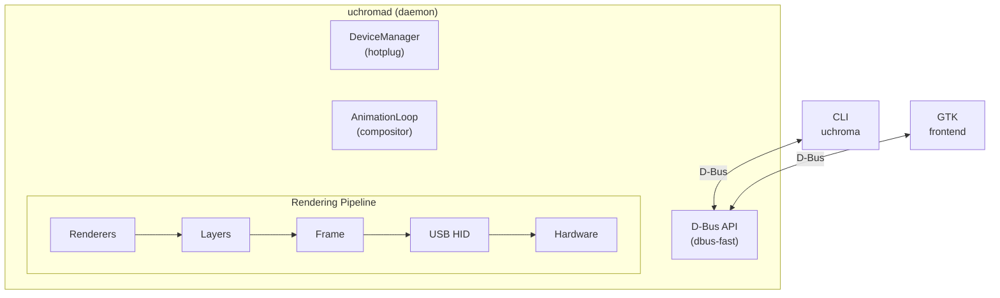
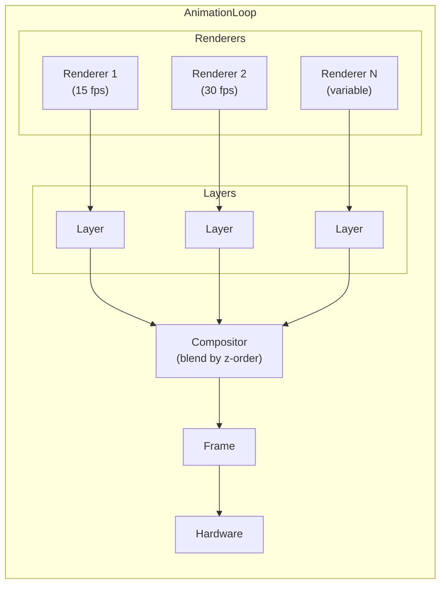

# System Architecture

This document explains how uchroma's components work together to deliver smooth, responsive lighting
effects on your Razer peripherals.

## High-Level Overview



The daemon (`uchromad`) manages devices, runs the animation engine, and exposes a D-Bus API. Clients
(CLI, GTK) communicate exclusively through D-Bus.

## Core Components

### DeviceManager

**Location:** `uchroma/server/device_manager.py`

The DeviceManager handles USB device discovery and hotplug events using pyudev. When a supported
Razer device is connected:

1. Detects the device via udev
2. Loads the appropriate device configuration from YAML
3. Creates a device driver instance
4. Publishes the device on D-Bus

```python
# Device enumeration flow
DeviceManager.start()
    → pyudev monitor watches for USB events
    → on device add: load_device(sysfs_path)
        → match vendor/product ID to YAML config
        → create UChromaDevice instance
        → fire callbacks for D-Bus publishing
```

### AnimationLoop

**Location:** `uchroma/server/anim.py`

The AnimationLoop is the heart of the rendering system. It implements a producer-consumer pattern
with double-buffering for smooth, CPU-efficient animations.



**Key Features:**

- **Async Design:** Each renderer runs in its own async task
- **Double Buffering:** Two buffers per renderer prevent tearing
- **Independent FPS:** Renderers can run at different frame rates
- **Efficient Waiting:** The loop only wakes when a renderer produces output

**Data Flow:**

1. Each `Renderer` has two queues: `_avail_q` (free buffers) and `_active_q` (ready frames)
2. Renderer draws to a `Layer`, puts it on `_active_q`
3. AnimationLoop waits on all renderer queues using `asyncio.wait(FIRST_COMPLETED)`
4. Loop composites layers by z-order using blend modes
5. `Frame.commit()` sends RGB data to hardware
6. Old buffers returned to renderers via `_avail_q`

### Renderer

**Location:** `uchroma/renderer.py`

The `Renderer` base class is what you extend to create custom effects. Each renderer:

- Runs in its own async task
- Has configurable parameters via traitlets
- Draws to a `Layer` buffer

```python
class Renderer(HasTraits):
    # Constants
    MAX_FPS = 30      # Animation loop cap
    DEFAULT_FPS = 15  # Default renderer FPS
    NUM_BUFFERS = 2   # Double-buffering

    # Lifecycle
    def init(self, frame) -> bool    # Called when activated
    async def draw(self, layer, timestamp) -> bool  # Called each frame
    def finish(self, frame)          # Called when deactivated
```

### Layer

**Location:** `uchroma/layer.py`

A `Layer` is a drawing surface backed by a numpy array. Layers support:

- Individual pixel operations (`put`, `get`)
- Shape drawing (`circle`, `ellipse`, `line`)
- Blend modes for compositing
- Direct matrix access for bulk operations

```python
# Internal structure
self._matrix = np.zeros(shape=(height, width, 4), dtype=np.float64)
#                              ↑      ↑     ↑
#                            rows   cols  RGBA
```

### Frame

**Location:** `uchroma/server/frame.py`

The `Frame` class manages the final framebuffer and hardware communication:

1. Creates Layer instances for renderers
2. Composites multiple layers using blend modes
3. Converts floating-point RGBA to hardware format
4. Sends data to device via USB HID

### D-Bus API

**Location:** `uchroma/server/dbus.py`

The D-Bus API exposes device functionality to clients:

| Interface                     | Purpose                       |
| ----------------------------- | ----------------------------- |
| `io.uchroma.DeviceManager`    | Device enumeration            |
| `io.uchroma.Device`           | Brightness, properties        |
| `io.uchroma.AnimationManager` | Layer/renderer management     |
| `io.uchroma.FXManager`        | Built-in effects              |
| `io.uchroma.LEDManager`       | Individual LED control        |
| `io.uchroma.SystemControl`    | Laptop fan/power (Blade only) |

## Animation System Deep Dive

### Producer-Consumer Pattern

The animation system uses async queues to decouple rendering from display:

```
Renderer._run():
    while running:
        async with ticker:           # Sync to FPS
            layer = await avail_q.get()  # Get free buffer
            layer.background_color = ...
            layer.blend_mode = ...

            status = await self.draw(layer, timestamp)

            if status:
                layer.lock(True)     # Make read-only
                await active_q.put(layer)  # Submit for display
```

```
AnimationLoop._animate():
    while running:
        async with ticker:
            await self._get_layers()      # Wait for any renderer
            await self._commit_layers()   # Composite and display
```

### Frame Rate Management

The `Ticker` utility synchronizes to target frame rates:

```python
class Ticker:
    async def __aenter__(self):
        self._start = time.monotonic()

    async def __aexit__(self, *args):
        elapsed = time.monotonic() - self._start
        remaining = self.interval - elapsed
        if remaining > 0:
            await asyncio.sleep(remaining)
```

### Layer Compositing

Layers are composited in z-order using blend modes from `uchroma/blending.py`:

| Mode           | Effect                             |
| -------------- | ---------------------------------- |
| `screen`       | Brightens, never darkens (default) |
| `soft_light`   | Subtle overlay                     |
| `lighten_only` | Maximum of both                    |
| `dodge`        | Brightening with contrast          |
| `multiply`     | Darkens, never brightens           |
| `hard_light`   | High contrast overlay              |
| `addition`     | Sum of colors                      |
| `difference`   | Absolute difference                |

## Key Constants

```python
# uchroma/renderer.py
MAX_FPS = 30        # Hard cap for animation loop
DEFAULT_FPS = 15    # Default renderer frame rate
NUM_BUFFERS = 2     # Double-buffering count
```

## Module Reference

| Module                             | Purpose                              |
| ---------------------------------- | ------------------------------------ |
| `uchroma/server/server.py`         | Daemon entry, signal handling        |
| `uchroma/server/device_manager.py` | USB hotplug, device enumeration      |
| `uchroma/server/device_base.py`    | Base device class, HID communication |
| `uchroma/server/anim.py`           | AnimationLoop, AnimationManager      |
| `uchroma/server/frame.py`          | Framebuffer, layer composition       |
| `uchroma/server/dbus.py`           | D-Bus interfaces                     |
| `uchroma/renderer.py`              | Base Renderer class                  |
| `uchroma/layer.py`                 | Layer drawing primitives             |
| `uchroma/blending.py`              | Blend mode implementations           |
| `uchroma/color.py`                 | Color utilities and schemes          |
| `uchroma/traits.py`                | Custom traitlet types                |
| `uchroma/fxlib/*.py`               | Built-in renderers                   |

## Performance Considerations

### CPU Efficiency

The async design ensures the daemon only wakes when:

- A renderer has a frame ready
- A D-Bus request arrives
- A device hotplug event occurs

### Memory Usage

- Each layer: `height * width * 4 * 8` bytes (float64 RGBA)
- Double buffering: 2 layers per renderer
- Typical keyboard (6x22): ~4 KB per layer

### Cython Hot Paths

Performance-critical code is implemented in Cython:

| File                        | Purpose                            |
| --------------------------- | ---------------------------------- |
| `uchroma/_layer.pyx`        | Pixel operations, color conversion |
| `uchroma/fxlib/_plasma.pyx` | Plasma effect calculations         |
| `uchroma/server/_crc.pyx`   | USB report CRC                     |

After modifying `.pyx` files, rebuild with:

```bash
make rebuild
```

## Next Steps

- [Creating Effects](./creating-effects) - Build your first custom renderer
- [Layer API](./layer-api) - Full drawing API reference
