# GTK Frontend

UChroma includes a GTK4/libadwaita frontend for visual RGB control. Real-time LED matrix preview,
effect cards, and a layer compositor—all in a polished desktop app.

## Launch

```bash
uchroma-gtk
```

Or via make:

```bash
make gtk
```

The app connects to the running `uchromad` daemon via D-Bus. If the daemon isn't running, you'll see
a prompt to start it.

## Window Layout

```mermaid
flowchart TB
    subgraph header["Header Bar"]
        direction LR
        device["Device Dropdown"]
        title["UChroma"]
        brightness["Brightness Slider"]
        power["⏻ Power"]
    end

    subgraph main["Main Content"]
        preview["Matrix Preview<br/>(real-time LED visualization)"]
        tabs["Effects | System"]

        subgraph mode["Mode Toggle"]
            hw["○ Hardware"]
            custom["● Custom"]
        end

        subgraph content["Content Area"]
            cards["Effect Cards<br/>or<br/>Layer Panel"]
        end

        subgraph settings["Parameter Inspector"]
            color["color: ████████"]
            speed["speed: ────●────"]
        end
    end

    header --> main
    preview --> tabs
    tabs --> mode
    mode --> content
    content --> settings
```



## Header Bar

### Device Selector

The dropdown at top-left shows all connected devices. Select "All devices" to control everything at
once, or pick a specific device.

When controlling multiple devices, the preview shows a multi-device view with each device's matrix.

### Brightness Slider

Horizontal slider (0-100%) with live update. Changes apply immediately to the selected device(s).

### Power Toggle

The power button suspends/resumes lighting. When suspended, the device LEDs turn off but
configuration is preserved.

## Matrix Preview

The LED matrix visualization shows what's currently displayed on your device. For hardware effects,
it shows a simulated preview. For custom animations, it streams the actual frames from the daemon.

The preview automatically adapts to your device's dimensions and highlights only the keys that exist
on your hardware (using the device's key mapping).

## Mode Toggle

Switch between two modes:

### Hardware Mode

Uses the device's built-in lighting effects. These run directly on the hardware with no CPU
overhead.

Effect cards appear in a horizontal flow. Click a card to activate that effect. The currently active
effect shows a highlight.

**Available effects vary by device**, but typically include:

- **Disable** — Turn off all lighting
- **Static** — Solid color
- **Wave** — Animated color wave
- **Spectrum** — Cycle through all colors
- **Reactive** — Keys light up when pressed
- **Breathe** — Pulsing colors
- **Starlight** — Sparkling effect
- **Ripple** — Ripples from keypresses

### Custom Mode

Software-rendered animations composited on the daemon and sent to hardware. This mode gives you full
creative control with multiple layers and blend modes.

The layer panel shows your animation stack:

```mermaid
flowchart TB
    subgraph layers["LAYERS &nbsp;&nbsp;&nbsp;&nbsp;&nbsp;&nbsp;&nbsp;&nbsp;&nbsp;&nbsp;&nbsp;&nbsp;&nbsp;&nbsp;&nbsp;&nbsp;&nbsp;&nbsp;&nbsp;&nbsp; + ▶ ■"]
        direction TB
        layer0["[0] Plasma &nbsp;&nbsp;&nbsp;&nbsp; ▼ Normal &nbsp;&nbsp; ○────● &nbsp; 🗑"]
        layer1["[1] Rainbow &nbsp;&nbsp; ▼ Screen &nbsp;&nbsp; ○──●── &nbsp; 🗑"]
    end
```



Each layer row shows:

- **Z-index** — Layer order (higher = on top)
- **Renderer name** — The effect type
- **Blend mode** — How this layer combines with layers below
- **Opacity slider** — Layer transparency
- **Delete button** — Remove the layer

## Adding Layers

Click the **[+]** button to open the renderer picker. A dialog shows all available renderers with
previews:

- **Plasma** — Colorful moving blobs
- **Rainbow** — Flowing gradient
- **Ripple** — Expanding rings from keypresses
- **Reaction** — Keys light up on press
- **Comets** — Streaking particles
- **Embers** — Floating sparks
- **Ocean** — Wave motion
- **Vortex** — Spinning pattern
- **Nebula** — Cosmic clouds
- **Aurora** — Northern lights effect

Select a renderer to add it as a new layer.

## Layer Controls

### Blend Modes

The blend mode dropdown controls how layers combine:

- **Normal** — Standard opacity blending
- **Screen** — Lightening blend (bright + bright = brighter)
- **Soft Light** — Gentle contrast adjustment
- **Dodge** — Strong lightening
- **Multiply** — Darkening blend

### Opacity

Drag the slider to adjust layer transparency. 0% = invisible, 100% = fully opaque.

### Drag to Reorder

Drag layers up/down to change their z-order. Higher layers render on top.

## Playback Controls

- **Play** [▶] — Start/resume animation
- **Stop** [■] — Stop and clear all layers

When paused, the preview freezes but layer configuration is preserved.

## Parameter Inspector

When you select an effect (hardware mode) or a layer (custom mode), the parameter inspector appears
at the bottom:

```mermaid
flowchart TB
    subgraph inspector["PLASMA SETTINGS"]
        direction TB
        color["color_scheme &nbsp;&nbsp;&nbsp;&nbsp; ████ ████ ████ &nbsp;&nbsp; Edit"]
        gradient["gradient_length &nbsp; ────────●────── &nbsp;&nbsp; 180"]
        preset["preset &nbsp;&nbsp;&nbsp;&nbsp;&nbsp;&nbsp;&nbsp;&nbsp;&nbsp;&nbsp;&nbsp;&nbsp;&nbsp;&nbsp;&nbsp; ▼ Qap"]
    end
```



Parameters update live as you adjust them. Changes apply immediately to the device.

### Color Parameters

Color traits show a swatch. Click to open a color picker. Color scheme traits show multiple swatches
for gradient colors.

### Numeric Parameters

Sliders for numeric values with min/max constraints. The current value displays alongside.

### Choice Parameters

Dropdowns for enum values like presets or directions.

## System Tab

For supported laptops (Blade series), the System tab provides:

- **Power Mode** — Balanced, Gaming, Creator, Custom
- **Fan Control** — Auto or manual RPM
- **CPU/GPU Boost** — Performance tuning

This tab only appears when a compatible laptop is detected.

## Keyboard Shortcuts

| Shortcut | Action              |
| -------- | ------------------- |
| `Ctrl+Q` | Quit                |
| `Ctrl+R` | Refresh device list |

## Environment Variables

| Variable                      | Description             |
| ----------------------------- | ----------------------- |
| `UCHROMA_LOG_LEVEL=DEBUG`     | Enable debug logging    |
| `UCHROMA_GTK_DEBUG=1`         | Extra GTK debug output  |
| `UCHROMA_LIVE_PREVIEW_FPS=10` | Live preview frame rate |

## Tips

**Preview without hardware**: The GTK app's preview works even without a connected device. Useful
for testing effects.

**Multi-device control**: Select "All devices" to apply the same effect across all your Razer gear
simultaneously.

**Quick toggle**: Use the power button to quickly disable lighting without losing your
configuration.

**Layer experiments**: Stack multiple renderers with different blend modes. Screen blend mode on a
rainbow layer over plasma creates interesting combinations.
