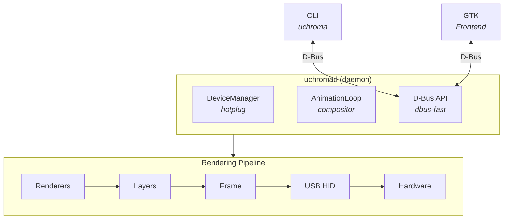

# Getting Started

UChroma is a userspace RGB control daemon for Razer Chroma peripherals on Linux. Pure Python, no
kernel drivers required.

## What You Can Do

**Hardware Effects** — Apply built-in lighting effects directly on your device: wave, spectrum,
reactive, starlight, breathe, and more.

**Custom Animations** — Stack multiple renderer layers with blend modes and live parameter control.
Plasma, rainbow, ripples, fire—all rendered at up to 30fps.

**GTK4 Frontend** — A gorgeous libadwaita app with real-time LED matrix preview, effect cards, and a
layer editor for custom animations.

**CLI Control** — Full control from the terminal. Script your lighting, save profiles, batch-control
multiple devices.

## Quick Links

| Guide                                 | Description                                  |
| ------------------------------------- | -------------------------------------------- |
| [Installation](installation.md)       | Prerequisites, udev rules, systemd setup     |
| [Quick Start](quick-start.md)         | First commands, your first animation         |
| [GTK App](gtk-app.md)                 | Visual frontend walkthrough                  |
| [Configuration](configuration.md)     | Preferences, profiles, environment variables |
| [Troubleshooting](troubleshooting.md) | Common issues and debug techniques           |

## Architecture Overview

The daemon discovers devices via udev, manages hardware communication over USB HID, and exposes
everything through D-Bus. Both the CLI and GTK app are pure clients—they never touch hardware
directly.

## Supported Devices

UChroma supports most Razer Chroma devices:

- **Keyboards** — BlackWidow, Huntsman, Ornata, DeathStalker, and more
- **Mice** — DeathAdder, Naga, Basilisk, Viper series
- **Mousepads** — Firefly, Goliathus Chroma
- **Headsets** — Kraken, BlackShark
- **Laptops** — Blade series with per-key RGB

Device definitions live in YAML files under `uchroma/server/data/`. If your device isn't recognized,
check the [troubleshooting guide](troubleshooting.md) for how to add support.

## Next Steps

1. [Install UChroma](installation.md)
2. [Run through the Quick Start](quick-start.md)
3. [Explore the GTK app](gtk-app.md)
